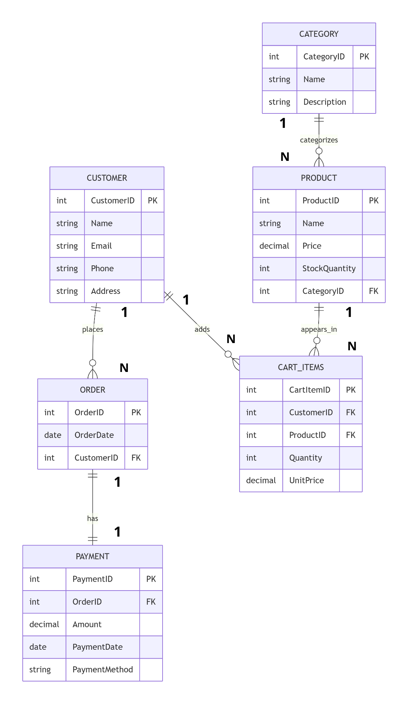

# 🗄️ Online Store Database Schema

This repository contains the SQL schema and queries for a fully relational **E-Commerce Database**. It demonstrates strong knowledge of database design, normalization, constraints, and complex querying.

## 🛠️ Project Features
* **Relational Design:** 6 connected tables (`Category`, `Customer`, `Product`, `Cart_Items`, `OrderTable`, `Payment`).
* **Data Integrity:** Used `PRIMARY KEY`, `FOREIGN KEY`, `UNIQUE`, and `CHECK` constraints to ensure valid data.
* **Complex Querying:** Includes a master query joining **5 tables** to generate a comprehensive sales report.

## 📂 Database Schema (ERD Logic)

The database tracks the flow from product listing to payment:
1.  **Category**: Product classification.
2.  **Product**: Stores price, stock, and links to Category.
3.  **Customer**: User details.
4.  **Cart_Items**: Many-to-Many relationship between Customer and Product.
5.  **OrderTable**: Links Customer to specific orders.
6.  **Payment**: Financial transaction details linked to Orders.

## 🔍 Featured Query (5-Table Join)
The project highlights an advanced SQL query that retrieves a full report by joining:
`Payment` ➡ `OrderTable` ➡ `Customer` ➡ `Cart_Items` ➡ `Product` ➡ `Category`.

```sql
SELECT 
    C.Name AS CustomerName,
    O.OrderID,
    Pay.Amount AS PaidAmount,
    Cat.Name AS CategoryName,
    P.Name AS ProductNameInCart
FROM Payment Pay
JOIN OrderTable O ON Pay.OrderID = O.OrderID            
JOIN Customer C ON O.CustomerID = C.CustomerID ...
